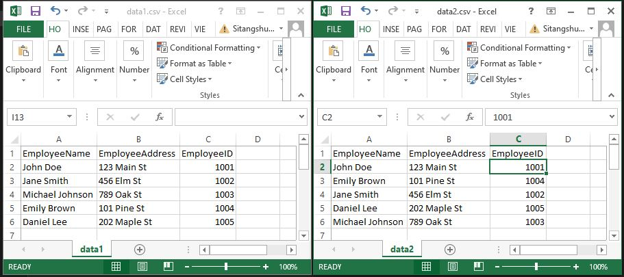

# AssertJ Assertions


# AssertJ Custom Assertions For Test Automation

Automated testing is a cornerstone of modern software development, ensuring reliability and efficiency in the development lifecycle. AssertJ, a fluent assertion library for Java, empowers developers to write expressive and readable tests. With its intuitive API and rich set of features, AssertJ simplifies the process of writing and maintaining test cases. From basic assertions to complex object comparisons, AssertJ provides a robust toolkit for verifying software behavior. In this blog, we'll explore how AssertJ enhances automation testing, enabling developers to create comprehensive test suites with ease. Let's dive into the world of AssertJ and harness its capabilities to elevate our testing practices.

# Maven

To include AssertJ in your Java project, include below maven dependency in your pom file. Check the maven repo [here](https://mvnrepository.com/artifact/org.assertj/assertj-core) for the latest versions

``` xml
<dependency>
    <groupId>org.assertj</groupId>
    <artifactId>assertj-core</artifactId>
    <version>3.25.3</version>
    <scope>test</scope>
</dependency>
```

Once you have included in your pom file, do the below static import in your test classes.

``` java
import static org.assertj.core.api.Assertions.assertThat;
```

# Basic AssertJ Examples:


Let's start with few simple examples.

# String Verification with AssertJ

When dealing with an array of Strings, ensuring their properties can be a complex task. AssertJ simplifies this process with its fluent assertion API, making it remarkably readable and easing the burden on developers.

- **String Length**: Verify that the size of the string is greater than 5 characters.
- **Substring Check**: Ensure that the string contains "i" as a substring.
- **Single Instance**: Confirm that the string contains only one instance of the letter "i".
- **Starts with**: Check if the string starts with the letter "a".
- **Exclusion**: Verify that the string does not contain "rest" as a substring.
- **Whitespace Absence**: Ensure that the string does not contain any whitespace characters. (any many more...)

AssertJ empowers developers to express these conditions succinctly, enhancing the readability and maintainability of code, ultimately simplifying the testing process.

``` Java
public class StringTest {

    @Test(dataProvider = "data")
    public void test(String actual) {
        assertThat(actual)
                .hasSizeGreaterThan(5)
                .contains("i")
                .containsOnlyOnce("i")
                .startsWith("a")
                .doesNotContain("rest")
                .doesNotContainAnyWhitespaces()
                .hasSize(9);
    }

    @DataProvider
    private String[] data () {
        return new String[] {
                "algorithm",
                "automation",
                "assertion"
        };
    }

}
```

Chaining various string checks

```java
String actual = "I am a test automation engineer";
assertThat(actual).doesNotStartWith("engineer")
                  .doesNotEndWith("automation")
                  .doesNotContain("developer")
                  .contains("test");
```

# Boolean Verification with AssertJ

``` Java
@Test
public void test() {
    boolean actual = true;
    assertThat(actual).isTrue();
    assertThat(actual).isEqualTo(true);
    assertThat(actual).withFailMessage("Value is not false")
            .isFalse();
}
```

# Not null / blank check

```Java
assertThat(actual).isNotNull()
                  .isNotBlank();
```

# Integer Verification with AssertJ

```java
assertThat(10).isBetween(5,15);
assertThat(10).isPositive()
                     .isGreaterThan(8)
                     .isLessThan(12);
```

# Date Verification with AssertJ

Dealing with date assertions are little bit annoying in general. AssertJ handles that very easily.

```java
LocalDate today = LocalDate.now();
LocalDate yesterday = LocalDate.now().minusDays(1);
LocalDate tomorrow = LocalDate.now().plusDays(1);

// Verify LocalDate properties
assertThat(today)
    .isAfter(yesterday) // Ensure today is after yesterday
    .isBefore(tomorrow) // Ensure today is before tomorrow
    .hasMonthValue(4) // Verify month value is 4 (April)
    .hasMonth(Month.APRIL) // Verify month is April
    .hasYear(2024) // Verify year is 2024
    .hasDayOfMonth(7); // Verify day of month is 7
```

You can also use date in String format as shown here.

```java
assertThat(today).isAfter("2023-01-01").isBefore("2026-12-31");
```

Chaining various date related assertions together.

```java
// Create a new Date object
Date date = new Date();

// Verify Date properties using AssertJ assertions
assertThat(date)
    .hasMonth(4) // Verify that the month is April (4)
    .hasDayOfMonth(7) // Verify that the day of the month is 7
    .hasHourOfDay(15) // Verify that the hour of the day is 15 (3 PM)
    .hasMinute(15); // Verify that the minute is 15
```

# List Verification with AssertJ

Let's see how AssertJ verify below verification points for a list.  

- **List Size**: Verify that the list has at least 2 elements.
- **List Size**: Verify that the list has exactly 3 elements.
- **Containment**: Verify that the list does not contain "cat".
- **Containment**: Verify that the list contains "car".
- **Containment**: Verify that the list contains all elements in the expected list.
- **Order Preservation**: Verify the exact order of elements in the list.
- **Element Order Flexibility**: Verify that the list contains all expected elements in any order.
- **Element Comparison**: Verify that the list contains all elements, irrespective of order, from the expected list.
- **Flexibility in Element Comparison**: Verify that the list contains all elements in any order, irrespective of order, from the expected list.
- **Element Properties**: Verify that all elements in the list have a length greater than or equal to 3.

```java
@Test(dataProvider = "getData")
public void test(List<String> actual) {

    // Define expected lists
    List<String> expected = Arrays.asList("car","ball");
    List<String> expectedWithSameOrder = Arrays.asList("ball","apple","car");
    List<String> expectedWithAnyOrder = Arrays.asList("car","ball","apple");

    // AssertJ assertions on the actual list
    assertThat(actual)
            .hasSizeGreaterThanOrEqualTo(2) // Verify that list has at least 2 elements
            .hasSize(3) // Verify that list has exactly 3 elements
            .doesNotContain("cat") // Verify that list does not contain "cat"
            .contains("car") // Verify that list contains "car"
            .containsAll(expected) // Verify that list contains all elements in the expected list
            .containsExactly(expectedWithSameOrder.toArray(new String[expectedWithSameOrder.size()])) // Verify exact order of elements
            .containsExactlyInAnyOrder(expectedWithAnyOrder.toArray(new String[expectedWithAnyOrder.size()])) // Verify elements in any order
            .containsExactlyElementsOf(expectedWithSameOrder) // Verify exact elements irrespective of order
            .containsExactlyInAnyOrderElementsOf(expectedWithAnyOrder) // Verify elements in any order irrespective of order
            .allSatisfy(str -> assertThat(str.length()).isGreaterThanOrEqualTo(3)); // Verify all elements satisfy a condition

}

@DataProvider
public Object[] getData(){
    return new Object[] {
            Arrays.asList("ball", "apple", "car")
    };
}
```
# File Verification with AssertJ

First, I create a simple file with below content and save it as src/test/resources/file1.txt. <br>
File contains...

```text
AssertJ is a powerful assertion library for Java that provides fluent and intuitive APIs for writing expressive and readable tests.
With AssertJ, developers can easily verify the behavior of their code by chaining together various assertions to form comprehensive test cases.
AssertJ offers a rich set of features, allowing developers to assert on different data types, including collections, strings, numbers, and dates, with ease.
By leveraging AssertJ's capabilities, developers can write more robust and maintainable tests, leading to improved software quality and reliability.
```
Now verify few properties and existence check for that file.

```java
@Test
    public void verifyFileProperties() {
        File actualFile = Paths.get("src/test/resources/file1.txt").toFile();
        assertThat(actualFile)
                .canRead() // Verify that file1 is readable
                .canWrite() // Verify that file1 is writable
                .hasName("file1.txt") // Verify the name of file1
                .hasExtension("txt") // Verify the extension of file1
                .hasParent("src/test/resources"); // Verify the parent directory of file1
    }
```

Now create one more file with some different text and save it as src/test/resources/file2.txt. <br>
File contains...

```text
AssertJ a powerful assertion library for Java that provides fluent and intuitive APIs for writing expressive and readable tests.
With AssertJ, developers can easily verify the behavior of their code by chaining together various assertions to form comprehensive test cases.
AssertJ offers a rich set of features, allowing developers to assert on different data types, including collections, strings, numbers, and dates, with ease.
By leveraging AssertJ capabilities, developers can write more robust and maintainable tests, leading to improved software quality and reliability.
```
Now compare this 2 files and let's see the output.

```java
@Test
public void compareFiles() {
    File actualFile = Paths.get("src/test/resources/file1.txt").toFile();
    File expectedFile = Paths.get("src/test/resources/file2.txt").toFile();

    assertThat(actualFile)
            .exists() // Verify that actualFile exists
            .isFile() // Verify that actualFile is a regular file
            .hasSameTextualContentAs(expectedFile); // Verify that actualFile has the same content as expectedFile
}
```

Output

``` output
java.lang.AssertionError: 
File:
  D:\Workspace\Github Projects\assertj\src\test\resources\file1.txt
and file:
  D:\Workspace\Github Projects\assertj\src\test\resources\file2.txt
do not have same content:

Changed content at line 1:
expecting:
  ["AssertJ a powerful assertion library for Java that provides fluent and intuitive APIs for writing expressive and readable tests."]
but was:
  ["AssertJ is a powerful assertion library for Java that provides fluent and intuitive APIs for writing expressive and readable tests."]

Changed content at line 4:
expecting:
  ["By leveraging AssertJ capabilities, developers can write more robust and maintainable tests, leading to improved software quality and reliability."]
but was:
  ["By leveraging AssertJ's capabilities, developers can write more robust and maintainable tests, leading to improved software quality and reliability."]
```


# CSV Verification with AssertJ

Let's assume we have 2 cvs files. Both are having same context but order is slightly different. 
If you want to do an exact match, use the above file compare approach. 
If the records order do not matter, we will follow the same approach we did for list compare. <br>



If we want to compare both csv files like the way we compare files then we can use below code.

```java
@Test
public void compareFiles() {
    File actualFile = Paths.get("src/test/resources/data1.csv").toFile();
    File expectedFile = Paths.get("src/test/resources/data2.csv").toFile();

    assertThat(actualFile)
            .exists() // Verify that actualFile exists
            .isFile() // Verify that actualFile is a regular file
            .hasSameTextualContentAs(expectedFile); // Verify that actualFile has the same content as expectedFile
}
```
Output

``` output
java.lang.AssertionError: 
File:
  D:\Workspace\Github Projects\assertj\src\test\resources\data1.csv
and file:
  D:\Workspace\Github Projects\assertj\src\test\resources\data2.csv
do not have same content:

Missing content at line 3:
  ["Emily Brown,101 Pine St,1004"]

Missing content at line 5:
  ["Daniel Lee,202 Maple St,1005"]

Extra content at line 7:
  ["Emily Brown,101 Pine St,1004",
   "Daniel Lee,202 Maple St,1005"]
```

Now if we want to read CVs files line by line and store it into List. Now we can compare the order of the CVS file as well the way we compare List previously. <br>

Below code compare 2 file contains. Order is not verified.

```java
@Test
public void compareCVS() throws IOException {
    List<String > actual = Files.readAllLines(Paths.get("src/test/resources/data1.csv"));
    List<String > expected = Files.readAllLines(Paths.get("src/test/resources/data2.csv"));

    assertThat(actual).containsAll(expected);
}
```
Same can be verified using below code.

```java
assertThat(actual).containsExactlyInAnyOrderElementsOf(expected);
```

if we want to verify the order then use below code.

```java
assertThat(actual).containsExactlyElementsOf(expected);
```

Error output is.

``` output
java.lang.AssertionError: 
Expecting actual:
  ["EmployeeName,EmployeeAddress,EmployeeID",
    "John Doe,123 Main St,1001",
    "Jane Smith,456 Elm St,1002",
    "Michael Johnson,789 Oak St,1003",
    "Emily Brown,101 Pine St,1004",
    "Daniel Lee,202 Maple St,1005"]
to contain exactly (and in same order):
  ["EmployeeName,EmployeeAddress,EmployeeID",
    "John Doe,123 Main St,1001",
    "Emily Brown,101 Pine St,1004",
    "Jane Smith,456 Elm St,1002",
    "Daniel Lee,202 Maple St,1005",
    "Michael Johnson,789 Oak St,1003"]
but there were differences at these indexes:
  - element at index 2: expected "Emily Brown,101 Pine St,1004" but was "Jane Smith,456 Elm St,1002"
  - element at index 3: expected "Jane Smith,456 Elm St,1002" but was "Michael Johnson,789 Oak St,1003"
  - element at index 4: expected "Daniel Lee,202 Maple St,1005" but was "Emily Brown,101 Pine St,1004"
  - element at index 5: expected "Michael Johnson,789 Oak St,1003" but was "Daniel Lee,202 Maple St,1005"
```

# Soft Assertions in AssertJ

Soft assertions in AssertJ allow you to collect multiple failures during a test without aborting immediately after the first failure. 
Instead, all failures are aggregated and reported at the end of the test. This is useful in scenarios where you want to verify multiple conditions in a single test case. <br>

To enable soft assertions in AssertJ, you can use the `SoftAssertions` class, which provides methods for performing assertions in a soft manner. 
Soft assertions can be particularly handy in scenarios where you want to verify the state of an object after performing multiple operations, ensuring that all expected conditions are met without prematurely failing the test. <br>

By using soft assertions, you can create more robust and informative tests, providing a comprehensive view of the test results even in the presence of multiple failures. <br>

The same list example we can have here.

```java
@Test(dataProvider = "getData")
public void test(List<String> actual) {
    List<String> expected = Arrays.asList("car","ball");
    List<String> expectedWithSameOrder = Arrays.asList("apple","car","ball");
    List<String> expectedWithAnyOrder = Arrays.asList("car","ball","apple");

    SoftAssertions.assertSoftly(s -> {
        s.assertThat(actual).hasSizeGreaterThanOrEqualTo(2)
                .hasSize(3)
                .doesNotContain("cat")
                .contains("car")
                .containsAll(expected)
                .containsExactly(expectedWithSameOrder.toArray(new String[expectedWithSameOrder.size()])) //here it should fail
                .containsExactlyInAnyOrder(expectedWithAnyOrder.toArray(new String[expectedWithAnyOrder.size()]))
                .containsExactlyElementsOf(expectedWithSameOrder)
                .containsExactlyInAnyOrderElementsOf(expectedWithAnyOrder)
                .allSatisfy(str -> assertThat(str.length()).isGreaterThanOrEqualTo(3));
    });
}

@DataProvider
public Object[] getData(){
    return new Object[] {
            Arrays.asList("ball", "apple", "car")
    };
}
```

Output

``` output
org.assertj.core.api.SoftAssertionError: 
The following 2 assertions failed:
1) 
Expecting actual:
  ["ball", "apple", "car"]
to contain exactly (and in same order):
  ["apple", "car", "ball"]
but there were differences at these indexes:
  - element at index 0: expected "apple" but was "ball"
  - element at index 1: expected "car" but was "apple"
  - element at index 2: expected "ball" but was "car"
at SoftAssertionsTest.lambda$test$1(SoftAssertionsTest.java:27)
2) 
Expecting actual:
  ["ball", "apple", "car"]
to contain exactly (and in same order):
  ["apple", "car", "ball"]
but there were differences at these indexes:
  - element at index 0: expected "apple" but was "ball"
  - element at index 1: expected "car" but was "apple"
  - element at index 2: expected "ball" but was "car"
at SoftAssertionsTest.lambda$test$1(SoftAssertionsTest.java:29)
```

# AssertJ Custom Assertions For Selenium WebDriver:

As we have seen above, AssertJ covers most of the data types for your assertions. It might be more than enough for our Selenium automated tests. For example, if we need to check if a WebElement is displayed.

```java
WebElement element = driver.findElement(By.id("id"));
//isDisplayed check
assertThat(element.isDisplayed()).isTrue();
```

However, it would be cool to have a separate assertion library for WebElement – to maintain a well readable and reusable code.

To implement your own assertion, create a new class by extending AbstractAssert class. Check this below sample for WebElement assertion.

```java
import org.assertj.core.api.AbstractAssert;
import org.openqa.selenium.WebElement;
import org.openqa.selenium.support.ui.ExpectedConditions;
import org.openqa.selenium.support.ui.WebDriverWait;

public class WebElementAssert extends AbstractAssert<WebElementAssert, WebElement> {

    private WebElementAssert(WebElement webElement) {
        super(webElement, WebElementAssert.class);
    }

    public static WebElementAssert assertThat(WebElement element){
        return new WebElementAssert(element);
    }

    public WebElementAssert isDisplayed() {
        isNotNull();
        if(!actual.isDisplayed()) {
            failWithMessage("Expected the element to be displayed. But it was not..!");
        }
        return this;
    }

    public WebElementAssert isEnabled(){
        isNotNull();
        //check condition
        if(!actual.isEnabled()){
            failWithMessage("Expected element to be enabled. But was not!!");
        }
        return this;
    }

    public WebElementAssert hasAttributeValue(String attr, String value){
        isNotNull();
        //check condition
        if(!actual.getAttribute(attr).equals(value)){
            failWithMessage("Expected element to have attr <%s> value as <%s>. But was not!!", attr, value);
        }
        return this;
    }

    public WebElementAssert isClickable(WebDriverWait wait) {
        isNotNull();
        //check condition
        try {
            wait.withMessage("Check element to be clickable")
                    .until(ExpectedConditions.elementToBeClickable(actual));
        } catch (Exception e) {
            failWithMessage("Element is not clickable !!!");
        }
        return this;
    }

    public WebElementAssert isButton(){
        isNotNull();
        //check condition
        if(!(actual.getTagName().equalsIgnoreCase("button") || actual.getAttribute("type").equalsIgnoreCase("button"))){
            failWithMessage("Expected element to be a button. But was not!!");
        }
        return this;
    }

    public WebElementAssert isLink(){
        isNotNull();
        //check condition
        if(!actual.getTagName().equalsIgnoreCase("a")){
            failWithMessage("Expected element to be a link. But was not!!");
        }
        return this;
    }

}
```

We can write same custom assertion for Page as well.

```java
import org.assertj.core.api.AbstractAssert;
import org.codewithsitangshu.custom.ui.pages.BasePage;

public class PageAssert extends AbstractAssert<PageAssert, BasePage> {

    private PageAssert(BasePage basePage) {
        super(basePage, PageAssert.class);
    }

    public static PageAssert assertThat(BasePage page){
        return new PageAssert(page);
    }

    public PageAssert isAt(){
        isNotNull();
        if(!actual.isAt()){
            failWithMessage("Page is not displayed");
        }
        return this;
    }

}
```
Now lets use our assertion library. <br>

For Page classes.

```java
public class HomePageTour extends BasePage {

    @Getter
    @FindBy(xpath = "//*[contains(@class,'shop-menu')]//a[normalize-space()='Home']")
    private WebElement homeButton;

    @Getter
    @FindBy(xpath = "//*[@class='left-sidebar']//h2[text()='Category']")
    private WebElement categorySection;

    public HomePageTour(WebDriver driver) {
        super(driver);
    }

    @Override
    public boolean isAt() {
        return this.driver.getTitle().equals("Automation Exercise");
    }

    public void goTo(){
        this.driver.get("https://automationexercise.com/");
        assertThat(homeButton)
                .isDisplayed()
                .isClickable(wait);
    }

}
```

For Test Classes.

```java
public class HomePageTest extends BaseTest {

    private HomePageTour homePageTour;

    @BeforeTest
    public void pageSetup(){
        this.homePageTour = new HomePageTour(driver);
    }

    @Test
    public void launchSite(){
        this.homePageTour.goTo();
        assertThat(this.homePageTour).isAt();
    }

    @Test
    public void verifyCategorySection() {
        assertThat(this.homePageTour.getCategorySection())
                .isDisplayed()
                .isEnabled();
    }
}
```

# AssertJ Custom Soft Assertions For Selenium WebDriver: